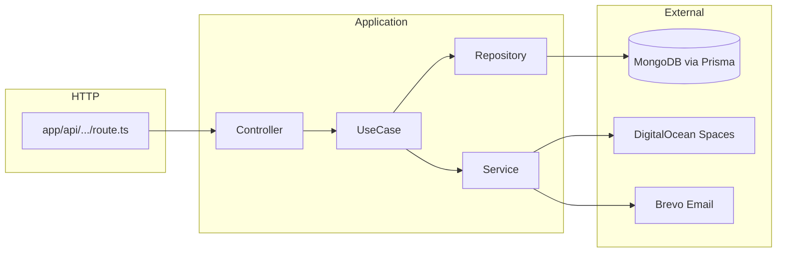
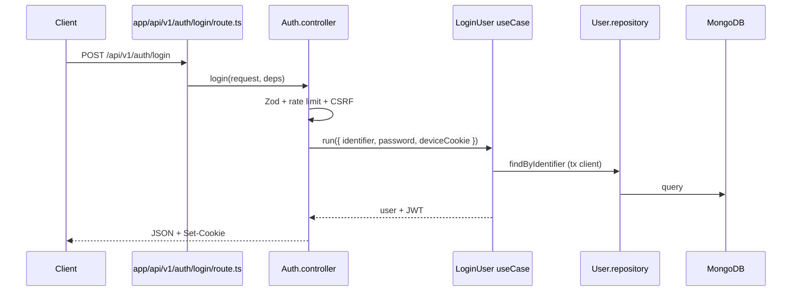

# Arquitetura — App

Documento curto sobre camadas e fluxo de requisições. Setup e endpoints: [`README.md`](../README.md). Glossário: [`glossary.md`](glossary.md).

## Visão geral

Aplicação **single-package** Next.js 15. A API REST vive em `src/app/api/v1/`. A UI usa App Router com locale (`src/app/[locale]/`).

## Deploy — máquina única (modelo atual)

O App **roda em uma única máquina / um processo Node**, sem load balancer e sem distribuição entre vários pods/réplicas.

Implicações:

- Rate limit in-memory por processo é **aceitável** neste modelo (não multiplica o teto efetivo).
- Sessão JWT já é stateless; sticky session não é requisito.
- Cache de processo e circuit breakers locais não precisam de store compartilhado.

Se a arquitetura evoluir para **múltiplos pods** atrás de um balanceador:

1. Rate limit de auth (e quotas quentes) deve migrar para o **API gateway / edge** na entrada do domínio, ou para store compartilhado (Redis) — o middleware in-memory deixa de ser suficiente sozinho.
2. Revisar caches em memória, health de dependências e jobs/cron para evitar duplicação entre réplicas.

## Diagrama — fluxo HTTP



### Exemplo concreto (login)



## Regras de dependência

| De → Para                                  | Permitido?                             |
| ------------------------------------------ | -------------------------------------- |
| `app/api` → controller                     | ✅                                     |
| controller → useCase                       | ✅                                     |
| useCase → repository / service             | ✅                                     |
| repository → Prisma (`injectables.prisma`) | ✅                                     |
| service → SDK externo (S3, fetch)          | ✅                                     |
| controller → repository / Prisma           | ❌                                     |
| useCase → `NextRequest` / React            | ❌                                     |
| component → repository                     | ❌                                     |
| repository → service                       | ❌ (service orquestrado pelo use case) |

Controllers são **finos**: validação HTTP (Zod), middlewares (rate limit, CSRF, auth), chamada `useCase.run()`, montagem de `NextResponse` (cookies, status).

## Composition root

[`src/container/dependencies.ts`](../src/container/dependencies.ts) cacheia **use cases** (e serviços leves) uma vez por processo. Rotas Next obtêm deps via `getDependencies()`.

Não instanciar use cases ad hoc em rotas — sempre via container.

**O que é singleton por performance** (não via construtor de use case):

- Prisma — `getPrismaClient()` / `runInTransaction` / `runWithoutTransaction` em `Db.manager.ts`
- Email / Spaces — `getEmailService()`, `getStorageService()`, `getStorageUrlService()`

**Repositories** não são injetados no container: `new Repo(injectables.prisma)` no `execute` (client da TX) ou root nas fases ADR-007.

## Master port e transações

Use cases estendem [`UseCaseMasterPort`](../src/masterPorts/UseCase.masterport.ts):

1. `validate(input)` — regras de entrada
2. `execute(input, { prisma })` — lógica de domínio
3. `run(input)` — orquestra validate + client Prisma + logging

**Transações:**

- Default `transactional = true` → `$transaction` (mutações Mongo puras).
- Leituras puras override `transactional = false` → sem TX.
- Uploads/deletes com Spaces override `transactional = false` e usam **fases** ADR-007 (`src/utils/workUnitPhases.ts`).

Repositories recebem `Prisma.TransactionClient` do injectable na fase B — **não** chamar `getPrismaClient()` direto em use cases (ESLint + ADR-008).

## Services vs repositories

| Tipo       | Exemplos                                            | Acesso a dados                   |
| ---------- | --------------------------------------------------- | -------------------------------- |
| Repository | `User.repository`, `Image.repository`               | Prisma exclusivamente            |
| Service    | `Storage.service`, `Brevo.service`, `Email.service` | APIs externas; sem Prisma direto |

`File.manager` coordena Storage + metadados — preferir chamá-lo a partir do use case, não do controller.

## UI e i18n

- Páginas: `src/app/[locale]/`
- Componentes: `src/components/`
- Textos: `src/constants/texts/{pt,en,es}.ts` + `next-intl`
- Client components consomem APIs via `src/lib/*-client.ts`

## Estrutura de pastas (resumo)

```
src/
  app/           # Rotas Next (pages + API)
  controllers/   # HTTP handlers por domínio
  useCases/      # Regras de negócio
  repositories/  # Prisma
  services/      # Integrações
  masterPorts/   # Contratos base (UseCase)
  container/     # DI / composition root
  middleware/    # auth, rate limit
  components/    # React UI
  constants/     # i18n, navigation, legal
  schemas/       # Zod compartilhado
tests/           # Espelho de src/
docs/            # Documentação humana/agente
```

## Decisões registradas

Ver [`docs/adr/README.md`](adr/README.md) para JWT, Spaces ACL, i18n, e-mail Brevo, etc.

## Contrato HTTP

- Spec OpenAPI: [`docs/openapi.yaml`](openapi.yaml)
- Swagger UI (opt-in): `GET /api/docs` — requer `SWAGGER_ENABLED=true` + Basic (`SWAGGER_USER` / `SWAGGER_PASSWORD`); spec em `GET /api/docs/openapi`
- Smoke manual: [`requests/`](../requests/)

## Referências

- [`AGENTS.md`](../AGENTS.md) — comandos e guardrails
- [`docs/glossary.md`](glossary.md) — termos de domínio
- [`docs/issue-workflow.md`](issue-workflow.md) — fluxo de tarefas
